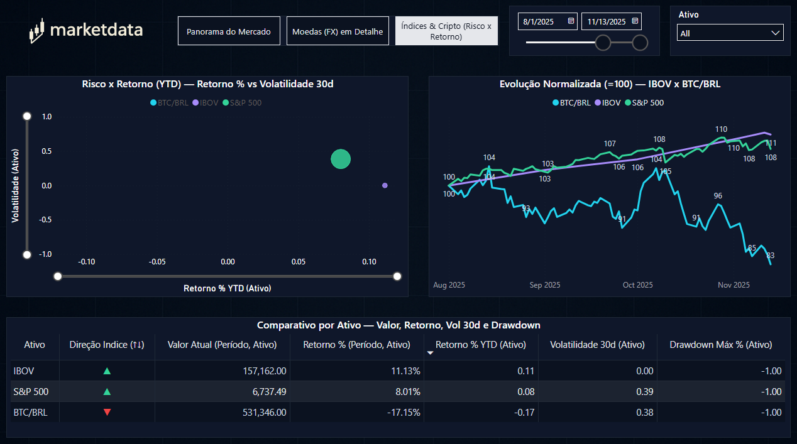

# 📈 Market Data Medallion — FX • Índices • Cripto (Power BI)

Pipeline de engenharia de dados (estilo **Medalhão: Bronze → Silver → Gold**) para coletar **câmbio**, **índices** e **cripto**, armazenar no **MariaDB**, e visualizar em **Power BI** com tema dark de mercado.

---

## 🗺️ Arquitetura & Fluxo

```
Fontes (APIs/CSV)
   ├─ ECB FX (EUR-base)          → Bronze: md_bronze.ecb_fx_raw
   ├─ PTAX USD/BRL               → Bronze: md_bronze.ptax_raw
   ├─ Stooq (S&P 500 etc.)       → Bronze: md_bronze.stooq_index_raw
   └─ Yahoo (^BVSP) — fallback   → Bronze: md_bronze.stooq_index_raw (mesma tabela)

Bronze  →  Silver (normalização) →  Gold (fatos/dimensões) →  Power BI
```

- **Silver** consolida e padroniza colunas/schemas.
- **Gold** expõe tabelas de consumo analítico (fatos e dimensões) que o Power BI usa.

### Principais Tabelas (Gold)
- `dim_calendario` — calendário completo (Y, M, Y-M, ISO semana etc.)
- `fact_fx_daily` — séries de FX por `currency_pair` (USD/BRL, EUR/BRL, GBP/BRL…)
- `fact_index_daily` — índices: `index_code` (`^spx`, `^bvsp`), `close_price`, `volume`
- `fact_crypto_daily` — cripto (BTC/BRL derivado do BTC/USD + FX quando aplicável)

---

## 📂 Estrutura do Projeto (essencial)

```
market-data-medallion/
├─ .env
├─ docker-compose.yml
├─ configs/
│  └─ sources.yaml
├─ data/
│  ├─ bronze/...
│  ├─ silver/...
│  └─ gold/...
├─ etl/
│  ├─ common/ (io.py, env.py, db.py, etc.)
│  ├─ bronze/
│  │  ├─ ingest_ecb_fx.py
│  │  ├─ ingest_ptax_usdbrl.py
│  │  ├─ ingest_coingecko_btcusd.py
│  │  ├─ ingest_stooq_indices.py
│  │  └─ ingest_yahoo_index.py     # ^BVSP via Yahoo (com fallback JSON)
│  ├─ silver/
│  │  ├─ normalize_fx.py
│  │  ├─ normalize_crypto.py
│  │  └─ normalize_indices.py
│  └─ gold/
│     └─ build_gold.py
├─ scripts/
│  └─ run_all.py
├─ powerbi/
│  └─ MarketData.pbix
├─ screenshots/
│  ├─ pagina1_panorama.png
│  ├─ pagina2_fx_detalhe.png
│  ├─ pagina3_indices_cripto.png
│  └─ pagina4_painel_bolsa.png
└─ assets/
   ├─ theme-market-dark.json
   ├─ bg_grid_dark.png
   └─ logo_marketdata.png
```

---

## 🐬 Banco de Dados (MariaDB)

Suba o banco com Docker:

```bash
docker compose up -d
```

`.env` (exemplo):
```
DB_HOST=localhost
DB_PORT=3306
DB_USER=market
DB_PASS=market
DB_NAME=marketdata
START_DATE=2025-01-01
```

> O Power BI se conecta ao MariaDB via **conector MySQL**.

---

## 🐍 Ambiente Python

Crie/ative o venv e instale dependências:

```bash
python -m venv .venv
source .venv/bin/activate  # Windows: .venv\Scripts\activate
pip install -r requirements.txt
```

---

## ▶️ Execução dos Pipelines

Rodar **tudo** (Bronze → Silver → Gold):

```bash
python scripts/run_all.py
# ou
python -m scripts.run_all
```

O `run_all.py` executa, nesta ordem:

```python
PIPELINES = [
  "etl.bronze.ingest_ecb_fx",
  "etl.bronze.ingest_ptax_usdbrl",
  "etl.bronze.ingest_coingecko_btcusd",
  "etl.bronze.ingest_stooq_indices",
  "etl.bronze.ingest_yahoo_index",
  "etl.silver.normalize_fx",
  "etl.silver.normalize_crypto",
  "etl.silver.normalize_indices",
  "etl.gold.build_gold",
]
```

### Conferência rápida (SQL)

```sql
-- Deve retornar linhas
SELECT COUNT(*) FROM md_bronze.stooq_index_raw WHERE code='^bvsp';
SELECT MIN(date), MAX(date) FROM md_bronze.stooq_index_raw WHERE code='^bvsp';
SELECT COUNT(*) FROM fact_index_daily WHERE index_code='^bvsp';
```

---

## 💻 Power BI — Abrir e Atualizar

### Conexão com MariaDB
1. **Get Data → MySQL database** (MariaDB usa o conector MySQL)  
2. **Server**: `localhost` (ou IP do container)  
3. **Database**: `marketdata`  
4. Autenticação: **Basic** (user/password do `.env`)

> Se for sua primeira conexão, instale o **MySQL Connector/NET** (driver).

### Atualizar dados
- Abra `powerbi/MarketData.pbix`  
- **Home → Refresh**  
- Verifique os slicers de **Data** e **Ativo**.

---

## 🎨 Tema & Identidade Visual

- Importar tema: **View → Themes → Browse → `assets/theme-market-dark.json`**  
- **Fundo de página**: `assets/bg_grid_dark.png` (transparência ~5–8%)  
- **Logo**: `assets/logo_marketdata.png` no canto superior esquerdo

### Paleta por ativo

| Ativo   | Cor |
|--------|-----|
| IBOV   | `#60A5FA` |
| S&P 500| `#93C5FD` |
| USD/BRL| `#22D3EE` |
| EUR/BRL| `#A78BFA` |
| GBP/BRL| `#34D399` |
| BTC/BRL| `#FDE68A` |

**Regras de variação**: positivo `#34D399`, negativo `#EF4444`, neutro `#E5E7EB`.

---

## 📊 Dashboard (Power BI)

O relatório está organizado em **quatro páginas**. As imagens estão em `./screenshots/`.

### 1) Panorama do Mercado
**Objetivo:** visão rápida do período selecionado.  
**Conteúdo:**
- **Cards** de “Último” e **Variação % (Período)** para USD/BRL, EUR/BRL, GBP/BRL, BTC/BRL, IBOV e S&P 500
- **Linha temporal** das séries FX
- **Barras** de Performance % (ranking)

**Imagem:**  


---

### 2) Moedas (FX) em Detalhe
**Objetivo:** detalhar comportamento das moedas vs BRL.  
**Conteúdo:**
- **Small multiples** (linhas) por par (USD/BRL, EUR/BRL, GBP/BRL)
- **Heatmap mensal** (variação média diária)
- **Tabela diária**: Fechamento, Var % d/d, MM7, Máx/Mín 30d
- **Slicers:** Data e Par Cambial

**Imagem:**  


---

### 3) Índices & Cripto (Risco x Retorno)
**Objetivo:** comparar **IBOV**, **S&P 500** e **BTC/BRL**.  
**Conteúdo:**
- **Scatter** Risco x Retorno (YTD): `Retorno % YTD` × `Volatilidade 30d`
- **Linha normalizada (=100)** para comparar trajetórias
- **Tabela** com: Valor Atual, Retorno % Período, Retorno % YTD, Volatilidade 30d, Drawdown Máx %

**Imagem:**  


---

## 🧪 DAX — Medidas úteis (exemplos)

```DAX
Período Selecionado =
FORMAT( MIN(dim_calendario[Data]), "dd/MM/yyyy") & " → " &
FORMAT( MAX(dim_calendario[Data]), "dd/MM/yyyy")

Direção (↑↓) =
VAR x = [FX Var % d/d]
RETURN IF( ISBLANK(x), BLANK(), IF( x > 0, "▲", IF( x < 0, "▼", "—" ) ) )

Cor Direção (↑↓) =
VAR x = [FX Var % d/d]
RETURN IF( ISBLANK(x), BLANK(),
           IF( x > 0, "#34D399", IF( x < 0, "#EF4444", "#E5E7EB" ) ) )
```

> Para **cores por ativo** nos gráficos, crie a medida `Cor Ativo` (SWITCH por `dAtivo[Ativo]`) e use **Conditional formatting → Data colors → Field value**.

---

## 🛠️ Troubleshooting

- **Yahoo 401/404 ao baixar ^BVSP**  
  O ingestor usa **session + user-agent** e **fallback JSON**. Rode `etl.bronze.ingest_yahoo_index`.  
  Verifique `.env` `START_DATE` e conectividade.

- **Scatter vazio na Página 3**  
  Use a medida **Volatilidade (Ativo)** resiliente (30d ou período) e confira o **Y-axis Start=0**.  
  Para valores fora de escala, use as versões “cap” (`Retorno % YTD (Cap)` / `Volatilidade (Cap)`).

- **Power BI não conecta ao MariaDB**  
  Use **Get Data → MySQL Database**, instale o **MySQL Connector** e valide host/porta/credenciais.

---

## 📄 Licença
Projeto para fins educacionais e de portfólio. Fontes públicas (ECB, PTAX/BCB, Stooq, Yahoo).  
Respeite termos de uso das APIs/datasets.
